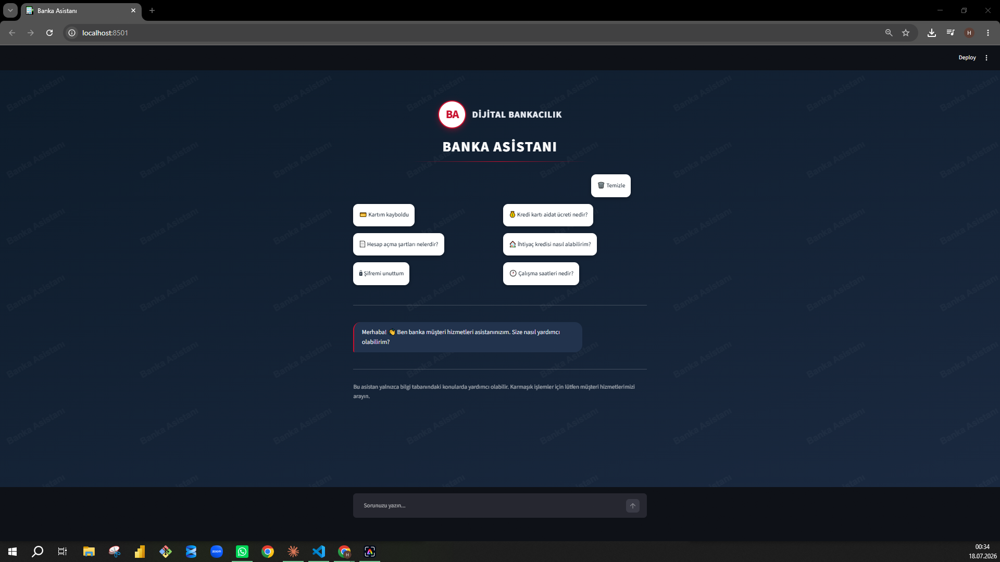

# 🏦 Banka Müşteri Hizmetleri Asistanı (RAG Chatbot)

Bir bankanın SSS/politika dokümanlarından beslenen, RAG (Retrieval-Augmented Generation) mimarisiyle çalışan Türkçe yapay zeka müşteri hizmetleri asistanı.

## 📋 Proje Hakkında

Bu chatbot, kullanıcıların bankacılık sorularını (hesap işlemleri, kredi kartı, krediler, döviz, yatırım, güvenlik) doğal Türkçe ile yanıtlar. En önemli özelliği: **bilgi tabanında olmayan sorulara halüsinasyon üretmek yerine dürüstçe "bilgim yok" der** — bu, regüle edilmiş bankacılık ortamı için kritik bir güvenlik özelliğidir.

## 🎥 Demo

*(Demo videosu için `images/demo.webm` dosyasına bakınız)*

## ✨ Özellikler

- **RAG mimarisi:** Cevaplar banka bilgi tabanından çekilir, uydurulmaz
- **Halüsinasyon koruması:** Bilgi tabanı dışı sorulara "bilgim yok" yanıtı
- **Semantik arama:** Farklı kelimelerle sorulsa da doğru bilgiyi bulur
- **Sohbet geçmişi:** Mesajlar chatbot arayüzünde birikir
- **Sohbeti temizleme:** Tek tıkla yeni konuşma
- **Kurumsal tasarım:** Lacivert-kırmızı-beyaz banka teması

## 🛠️ Teknolojiler

- **Python**
- **LangChain** — RAG pipeline
- **Google Gemini API** — LLM ve embedding
- **FAISS** — vektör veritabanı (semantik arama)
- **Streamlit** — web arayüzü

## 🔄 Nasıl Çalışır?

1. Banka SSS dokümanı parçalara (chunk) bölünür
2. Her parça Gemini embedding ile vektöre çevrilip FAISS'e kaydedilir
3. Kullanıcı soru sorduğunda, en alakalı parçalar semantik arama ile bulunur
4. Bulunan parçalar + soru, Gemini LLM'e gönderilir
5. LLM, yalnızca bu bağlama dayanarak yanıt üretir

## 🚀 Kurulum ve Çalıştırma

\`\`\`bash
# Kütüphaneleri kur
pip install -r requirements.txt

# .env dosyası oluştur ve Gemini API anahtarını ekle
# GOOGLE_API_KEY=your_api_key_here

# Bilgi tabanını işle ve FAISS veritabanını oluştur
python rag_pipeline.py

# Web uygulamasını başlat
streamlit run app.py
\`\`\`

## 📁 Proje Yapısı

\`\`\`
banking-rag-chatbot/
├── data/
│   └── bank_faq.txt          # Banka bilgi tabanı
├── images/
│   ├── ana_ekran.png         # Arayüz ekran görüntüsü
│   └── demo.webm             # Demo videosu
├── rag_pipeline.py           # RAG pipeline (embedding + FAISS)
├── app.py                    # Streamlit web arayüzü
├── requirements.txt
└── README.md
\`\`\`

## 📝 Not

Bu proje eğitim/portföy amaçlı geliştirilmiştir. Bilgi tabanındaki tüm veriler kurgusaldır.