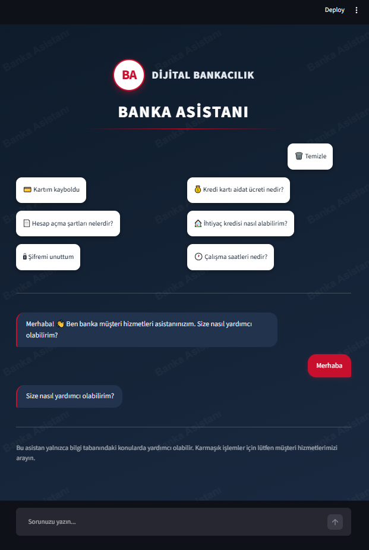

# 🏦 Banka Müşteri Hizmetleri Asistanı (RAG Chatbot)

Bir bankanın sık sorulan sorular ve politika dokümanlarından beslenen, **RAG (Retrieval-Augmented Generation)** mimarisiyle çalışan Türkçe yapay zeka müşteri hizmetleri asistanı.

## 📋 Proje Hakkında

Bu chatbot, kullanıcıların bankacılık sorularını (hesap işlemleri, kredi kartı, krediler, döviz, yatırım ve güvenlik) doğal bir Türkçe ile yanıtlar.

En önemli özelliği: **bilgi tabanında yer almayan sorulara uydurma (halüsinasyon) cevap üretmek yerine, dürüstçe "bu konuda bilgim yok" der.** Bu davranış, doğru bilginin kritik olduğu bankacılık ortamı için önemli bir güvenlik özelliğidir.

## 🎥 Demo



Uygulamanın canlı kullanımını gösteren **demo videosu**: [`images/demo.webm`](images/demo.webm)

Farklı soru tiplerinin (doğrudan sorular, bilgi tabanı dışı sorular, anlamsal eşleşme testleri) yanıtlarını gösteren **test sonuçları**: [`images/test_sonuclari.pdf`](images/test_sonuclari.pdf)

## ✨ Özellikler

- **RAG mimarisi:** Cevaplar banka bilgi tabanından çekilir, uydurulmaz
- **Halüsinasyon koruması:** Bilgi tabanı dışındaki sorulara "bilgim yok" yanıtı verir
- **Anlamsal (semantik) arama:** Soru farklı kelimelerle sorulsa bile doğru bilgiyi bulur
- **Sohbet geçmişi:** Mesajlar arayüzde alt alta birikir, gerçek bir sohbet deneyimi sunar
- **Sohbeti temizleme:** Tek tıkla yeni bir konuşma başlatılabilir
- **Kurumsal tasarım:** Lacivert, kırmızı ve beyaz tonlarında profesyonel banka teması

## 🛠️ Kullanılan Teknolojiler

- **Python**
- **LangChain** — RAG pipeline yönetimi
- **Google Gemini API** — dil modeli (LLM) ve embedding
- **FAISS** — vektör veritabanı (anlamsal arama)
- **Streamlit** — web arayüzü

## 🔄 Nasıl Çalışır?

1. Banka bilgi tabanı (SSS dokümanı) anlamlı parçalara (chunk) bölünür
2. Her parça, Gemini embedding modeli ile sayısal vektöre çevrilip FAISS veritabanına kaydedilir
3. Kullanıcı bir soru sorduğunda, soruya en alakalı parçalar anlamsal arama ile bulunur
4. Bulunan parçalar ve soru, Gemini dil modeline gönderilir
5. Dil modeli, yalnızca bu bağlamdaki bilgiye dayanarak yanıt üretir

## 🧪 Test Edilen Senaryolar

Chatbot, farklı soru tipleriyle test edilmiştir:

| Test Türü | Örnek Soru | Beklenen Davranış |
|---|---|---|
| Doğrudan bilgi | "Kredi kartı aidatı ne kadar?" | Bilgi tabanından doğru cevap |
| Anlamsal eşleşme | "Telefonumu kaybettim, kartıma ne olur?" | "Kayıp kart" bilgisini bulur |
| Bilgi tabanı dışı | "Bitcoin alabilir miyim?" | "Bilgim yok" yanıtı (uydurmaz) |
| Anlamsız girdi | "asdfgh" | "Bilgim yok" yanıtı |
| Çok parçalı soru | "Aidattan nasıl muaf olurum, öğrenciysem?" | Her iki kısmı da yanıtlar |

## 🚀 Kurulum ve Çalıştırma

````bash
# 1. Gerekli kütüphaneleri kurun
pip install -r requirements.txt

# 2. Proje kök dizininde bir .env dosyası oluşturun ve Gemini API anahtarınızı ekleyin:
#    GOOGLE_API_KEY=sizin_api_anahtariniz

# 3. Bilgi tabanını işleyip FAISS veritabanını oluşturun
python rag_pipeline.py

# 4. Web uygulamasını başlatın
streamlit run app.py
````

## 📁 Proje Yapısı

````
banking-rag-chatbot/
├── data/
│   └── bank_faq.txt          # Banka bilgi tabanı (SSS dokümanı)
├── images/
│   ├── ana_ekran_2.png       # Arayüz ekran görüntüsü
│   ├── demo.webm             # Demo videosu
│   └── test_sonuclari.pdf    # Test senaryoları ve sonuçları
├── rag_pipeline.py           # RAG pipeline (embedding + FAISS oluşturma)
├── app.py                    # Streamlit web arayüzü
├── requirements.txt          # Gerekli kütüphaneler
└── README.md
````

## 📝 Not

Bu proje eğitim ve portföy amacıyla geliştirilmiştir. Bilgi tabanındaki tüm veriler kurgusaldır ve gerçek bir bankaya ait değildir.
````
````